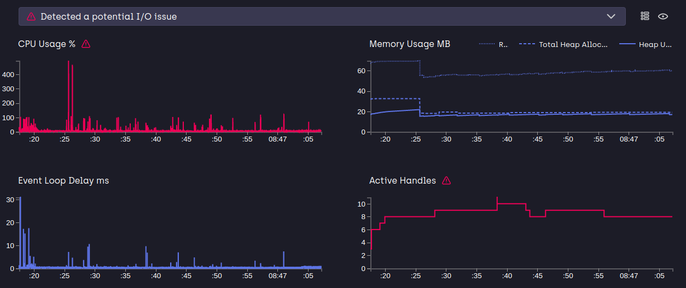

# Bus Ticket Booking Backend Service
The stack used here is MEN(MongoDB, Express, NodeJS)

**The API documentation can be accessed at:**

> www.shortto.com/apidocumentation

**The App is deployed on AWS ec2 and can be accessed at:**

> http://ec2-15-206-100-217.ap-south-1.compute.amazonaws.com:8080

or

> http://15.206.100.217:8080/

**Monitoring Results:**

**1) Using doctor**

